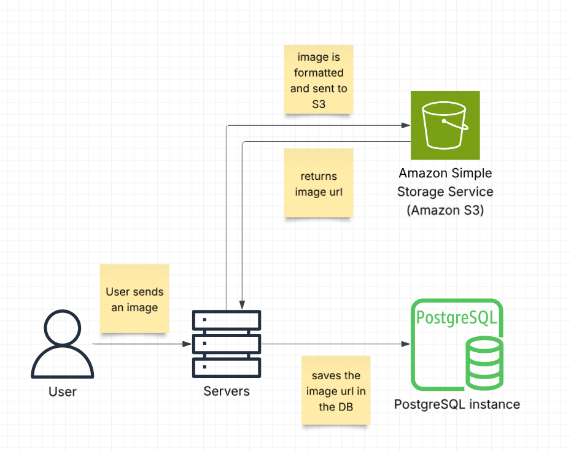

# Profile images

## Overview

___
We allow both mentors and mentis to upload profile picture, that will be shown in their profile page.

### Getting an image

* URL: `/{role}/image/{userId}`
* Method: `GET`

### Posting the image

* URL: `/{role}/image/{userId}`
* Method: `PUT`
* Body: `multipart/form-data`

___

## Design:

___
